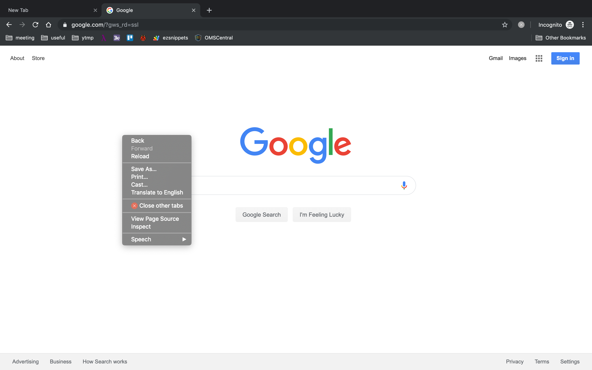

# close-other-tabs

"Close other tabs" disappeared since Chrome 78 canary build. So, I'm creating a new chrome extension to close all other tabs.

<div align="center">

</div>

## BUILD

```
# npm install
npm run build
```

## BUILD zip file to upload

```
npm run zip
```

## References

<div>Icons made by <a href="https://www.flaticon.com/authors/smashicons" title="Smashicons">Smashicons</a> from <a href="https://www.flaticon.com/"             title="Flaticon">www.flaticon.com</a></div>
